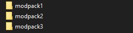
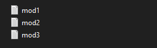
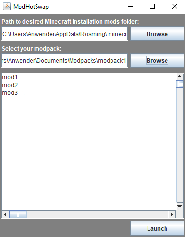

# mc-modhotswap

## Description
A small java tool to easily and externally switch between multiple minecraft/mods firectory configurations without having to have multiple profiles. 

## Usage
Creates "Documents/Modpacks" folder on first run. Simply drop various modpacks into it.

Inside of which the mod.jar files are located.

Afterwards check the modlist, choose between the the modpacks and launch into minecraft.

